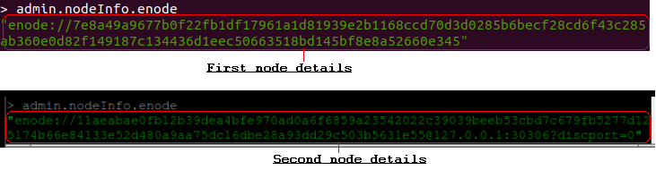

# EthPrivateP2P
P2P Ethereum Private Network Setup Configurations and Steps. Setup steps for private network across different organization, enitity, individual, etc.

## Prerequisites
1) At least two computer which does not share the same internet.
2) Have geth install for all the involved computers to function as nodes.

## Setup steps

#### 1) Create empty folder for both nodes with any name to store blockchain data
We will create a folder in our first node name 'EthPrivNode1'.
Second node empty folder will be named 'EthPrivNode2'.


#### 2) Prepare custom genesis.json file
genesis.json file can be prepared with the following code:

 

Each component of the genesis.json file can be modified based on environment requirements.

Once the genesis file has been configured, duplicate it across all the nodes in the new directory created in step 1.

#### 3) Write the genesis block to private chain
Specify a new directory for the private blockchain data to be stored when the genesis state is being written.


Perform this step for all the nodes involved by making necessary amendments. This is to make sure all the nodes have the same genesis block.
When this step is done, folder for all the nodes created in step 1 should look like this.


#### 4) Initialize the nodes
Initialize all the nodes involved by running the command. Image shows the command to initialize the node on first PC and second PC respectively.


#### 5) Enable portforwarding
Portforwarding needs to be enabled for other nodes to connect to the nodes in this network. The first node port would be 30303, and second node would be 30306 respectively.

#### 6) Start geth javascript console
Once the nodes have been initialized, open a new terminal tab and run the following command for each nodes.


#### 7) Retrieve node identity details
In the javascript console, type:
```admin.nodeInfo.enode```
and repeat for each nodes.



#### 8) Connect the nodes
In the second node, connect to the first node that have enabled portforwarding at 30303, and add the first node as a peer by running the following command.


#### 9) Check if peers have been added
In both nodes run the following command in the javascript console:
```admin.peers```

The result should appear for the first node as such:


And second node as such:


## Metamask connectivity to private network

#### 1) Intialize the nodes

#### 2) Check node initialization command
ensure that --rpccorsdomain "[any related node/customer/organization/entity/individual's ip address OR \*]" command is included when initializing bootstrap node.

#### 3) Portforwarding
Enable portforwarding at bootstrap node @ 8085(or any rpcport accordingly).

#### 4) Use metamask to connect
Have metamask extension installed in your browser and change the network to custom RPC, and do the as below.


Click on Save button and metamask will connect to the private ethereum network.
When metamask has been successfully connected to your private network, it will be shown as the image below.

